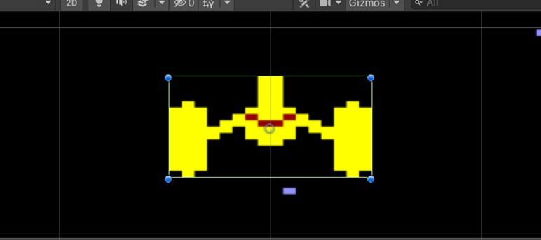

# Tema 1. Primer contacto con 2D

- [Tema 1. Primer contacto con 2D](#tema-1-primer-contacto-con-2d)
- [1.  Nuestro primer Proyecto](#1--nuestro-primer-proyecto)
- [2. El Entorno de Unity](#2-el-entorno-de-unity)
- [3. Imagen de fondo](#3-imagen-de-fondo)
- [4. Nave. Nuestro primer script.](#4-nave-nuestro-primer-script)
  - [Moviendo la nave. Nuestro primer Script.](#moviendo-la-nave-nuestro-primer-script)
  - [Movimiento de la nave independiente del equipo](#movimiento-de-la-nave-independiente-del-equipo)
- [5. Creación de un enemigo con movimiento independiente.](#5-creación-de-un-enemigo-con-movimiento-independiente)
  - [Más enemigos. Grupos de objetos.](#más-enemigos-grupos-de-objetos)
- [6. Primer contacto con los prefabs.](#6-primer-contacto-con-los-prefabs)
- [7. Un sprite animado.](#7-un-sprite-animado)
- [8. Aplicando cambios al prefab.](#8-aplicando-cambios-al-prefab)
- [9. Editar propiedades desde el inspector.](#9-editar-propiedades-desde-el-inspector)
- [10. Rigidbody 2D.](#10-rigidbody-2d)
  - [Comprobación de colisiones. BoxCollider2D](#comprobación-de-colisiones-boxcollider2d)
  - [Detección de colisiones (Trigger)](#detección-de-colisiones-trigger)
- [11. Añadir un disparo. Instantiate.](#11-añadir-un-disparo-instantiate)
  - [Movimiento del disparo. GetComponent.](#movimiento-del-disparo-getcomponent)
  - [Destruir enemigos.](#destruir-enemigos)
- [12. Explosión usando un sistema de partículas.](#12-explosión-usando-un-sistema-de-partículas)


# 1. <a name="_apartado1"></a> Nuestro primer Proyecto

Una vez tengamos instalado Unity Hub y la versión elegida de Unity, normalmente nuestra forma de empezar a trabajar será mediante Unity Hub.
Cuando entremos en Unity Hub, iremos a la pestaña Projects, que nos permitirá abrir los proyectos que tengamos, así como crear nuevos proyectos pulsando el botón New:


Introduciremos en la siguiente pantalla el nombre y tipo del proyecto (es posible que tengamos que descargar la plantilla):


Y ya podremos crearlo, en nuestro caso nuestro proyecto se va a llamar Marcianos y será un juego en 2D:


Durante unos instantes se cargará nuestro proyecto en el entorno de Unity…


# 2. <a name="_apartado2"></a>El Entorno de Unity

Vamos a describir brevemente las distintas zonas de la pantalla por defecto de Unity.

Si no os sale de la siguiente manera podéis cambiar en el desplegable de arriba a la derecha el Layout a Default.


- La zona central de la pantalla está ocupada por la zona Escena (**Scene**). En ella tendremos la parte visible de nuestro juego. Nos podremos mover por la misma y acercarnos o alejarnos para ver en detalle elementos que formarán parte del juego.
En esa misma zona, en la pestaña **Game**, se ejecutaría el juego.

- La jerarquía (**Hyerarchy**). Situada a la izquierda, contendrá los objetos que forman parte del juego. Al iniciar el proyecto únicamente nos aparece una cámara.
  
- En la parte derecha aparece el **Inspector**. En él podremos ajustar las propiedades de los objetos.

- En la parte inferior aparece el **Project**, donde estarán situados los ficheros que forman parte de nuestro proyecto, entre ellos los Assets, que como dijimos en el tema 1 son elementos que componen un juego (modelos, texturas, scripts, sonidos, animaciones…)

- La barra superior nos permite mover, rotar y cambiar el tamaño de los objetos. De momento únicamente vamos a utilizar el botón Play que nos permite ejecutar nuestro juego (de momento únicamente nos saldrá una pantalla en azul).


Para parar el juego pulsamos el botón Stop:


# 3. <a name="_apartado3"></a>Imagen de fondo

A continuación, vamos a cambiar el **fondo** de nuestro juego (recordad que estamos realizando un juego 2d) y encuadraremos nuestra **cámara**.

Vamos a crear una carpeta en nuestro proyecto para guardar imágenes. 

En el panel inferior, dentro de **Assets**, pulsaremos el botón derecho y elegiremos la opción **Create->Folder**. Crearemos una carpeta llamada **Sprites**.


Para introducir imágenes en esta carpeta las arrastraremos desde el explorador de Windows a la carpeta dentro de Unity. Se os ha dejado un fichero llamado SpaceHawks donde tenéis algunos recursos.

En nuestro caso añadiremos el fichero **fondo960.png**.
En ese momento veremos la miniatura dentro de la carpeta:


A continuación, vamos a crear un **objeto de juego (Game Object)** a partir de esa imagen. Una posible forma, y la más sencilla es arrastrar la imagen desde el panel inferior a la escena (**Scene**). De momento no queda centrado:


Para centrar la imagen vamos a utilizar el panel **Inspector** que aparece a la derecha. Recordad que el panel inspector nos permite modificar las propiedades de un **objeto**.

En este caso vamos a cambiar la propiedad transform. El **Transform** es usado para almacenar la posición, rotación y escala de un **GameObject**.

En Unity, el centro de la pantalla corresponde a las coordenadas (0,0), por lo que bastaría con cambiar el valor de X y el de Y en la posición, para hacer que ambos sean cero:


Una forma más rápida de hacer esto es desplegar los tres puntos que aparecen a la derecha del Transform y elegir la opción **Reset**:


También vamos a cambiar el nombre del objeto de fondo960 a Fondo:


Si volvemos a lanzar el juego, se verá el fondo centrado, pero con un borde azul alrededor:


Para cambiar esto, vamos a elegir la cámara (**Main Camera**) dentro de la jerarquía (panel izquierdo **Hierarchy**) y el inspector nos mostrará sus propiedades:


Para que la cámara se ajuste mejor a nuestro fondo podemos cambiar su tamaño en el inspector con la propiedad **Size**, bien dándole un valor, o más sencillo, haciendo click con el ratón y desplazando a izquierda/derecha:


Quedará algo de margen por los lados, ya que el fondo está diseñado para 4:3, en lugar de 16:9.

Podemos pulsar **Play** para ver cómo está quedando el juego con el nuevo fondo…
Podemos desanclar la pantalla **Game** para verla más grande e incluso maximizarla:


Incluso podemos elegir **Play Maximized** para ver el juego a pantalla completa.

Podemos también cambiar el color de fondo de la cámara para, por ejemplo, tener un color gris similar al del fondo:


Utilizamos para ello la propiedad **Background**.
Debemos ser cuidadosos a la hora de no hacer cambios durante la ejecución del juego, ya que puede ocurrir que esos cambios no se mantengan al detener la ejecución.

# 4. <a name="_apartado4"></a>Nave. Nuestro primer script.

Vamos a añadir una imagen que representará la nave que vamos a manejar.
Para ello inicialmente añadimos su imagen a la carpeta **Sprites** dentro de **Project**.

A continuación, la añadiremos como Game Object a nuestro juego. Esto lo podemos hacer arrastrando directamente a la escena, o bien arrastrando a la jerarquía (**Hierarchy**).

Al arrastrar a la escena se colocará en el sitio donde soltemos, mientras que al arrastrar a la jerarquía lo hará centrado en la posición (0, 0).

En este punto podría ocurrir que se nos solapara la imagen de la imagen con la del fondo y que no se viera. Para evitar esto (más adelante lo haremos con Layers) podemos cambiar en el inspector el **Order in Layer** a 1 de la nave.


Ahora vamos a mover la nave a su posición inicial en el juego. Eso lo podemos hacer de varias formas. 

Una de ellas es en el inspector, como hemos visto antes a través del **transform**, con su coordenada Y.

También lo podemos hacer utilizando la herramienta **Mover**, que tenemos en la barra de herramientas.

Aparecerán entonces dos flechas sobre el objeto que nos permitirán moverlo en horizontal o en vertical (o ambas si utilizamos el recuadro):


## Moviendo la nave. Nuestro primer Script.

Para añadir comportamientos a los objetos deberemos crear un Script. En Unity los scripts determinan el comportamiento de los objetos y están escritos en **C#**.

En primer lugar, crearemos una carpeta Scripts dentro de Assets.


Ahora seleccionaremos la nave y en el inspector pulsaremos el botón **Add Component**:


Y en el desplegable que aparece elegiremos New Script:


Al cual le daremos el nombre Nave y lo guardaremos en la carpeta **Scripts**. Si hacemos click sobre el script **Nave**, nos aparece su contenido en el inspector:


Y haciendo **doble click** sobre el mismo se nos abrirá para poder editarlo.


En principio se debería abrir en el **Visual Studio**. En el menú **Edit->Preferences->External Tools** nos permite elegir el editor de Scripts.

Es muy posible que el editor de Visual Studio no nos haga “sugerencias” respecto al código de Unity (por ejemplo, sugerirnos los métodos del objeto transform que ya estudiaremos más adelante).

Para conseguir tener esas sugerencias debemos instalar desde el Visual Studio Installer:


E instalar los componentes para Desarrollo de juego con Unity:


Volviendo de nuevo al **Script** aparece la clase `Nave` que hereda de `MonoBehaviour` y con dos métodos: `Start` (se lanza al crear el objeto), y `Update` (que se lanza una vez para cada fotograma del juego).

Para mover la nave podríamos mirar las teclas individuales, pero en este caso es más útil mirar el desplazamiento horizontal que haya hecho el usuario con las teclas tanto las WASD como las flechas del teclado:

```csharp
float horizontal = Input.GetAxis("Horizontal");
```
Ese valor será negativo si el usuario ha indicado que desea moverse hacia la izquierda y positivo si ha indicado que desea moverse hacia la derecha. 

En el caso del teclado, los valores serían -1 o +1 (o 0, si no se ha indicado movimiento), pero en un joystick o gamepad analógico, podría haber valores intermedios (por ejemplo, 0.35). Si no deseamos valores intermedios, sino sólo -1, 0, +1, podríamos usar `Input.GetAxisRaw`.

Para desplazar la nave utilizaremos su posición, que forma parte de su componente `Transform`.

Utilizaremos `transform.Translate` indicando el desplazamiento en X (horizontal), en Y (vertical, que no habrá para la nave), y en Z (que no tiene sentido para el juego 2D).

```csharp
transform.Translate(horizontal, 0, 0);
```

El problema es que en las nuevas versiones de Unity esta línea no funcionaría ya que ahora por defecto se utiliza el nuevo **Input System**.

El código para poder hacer lo que queremos sería el siguiente:

```csharp
using UnityEngine;
using UnityEngine.InputSystem;

public class Nave : MonoBehaviour
{
    // Objeto al que le asignaremos el asset con el Input System
    public InputActionAsset inputActions;
    private InputAction moveAction;
    private float velocidad = 2;


    // Start is called once before the first execution of Update after the MonoBehaviour is created
    void Start()
    {
        // Recogemos el mapa de acciones asignadas al Player
        var playerActionMap = inputActions.FindActionMap("Player");

        // Recogemos la acción mover
        moveAction = playerActionMap.FindAction("Move");
        moveAction.Enable();

    }

    // Update is called once per frame
    void Update()
    {
        Vector2 move = moveAction.ReadValue<Vector2>();
        // Si el usuario mueve en horizontal
        float horizontal = move.x;

        transform.Translate(horizontal, 0, 0);
    }
}
```

Para comprobar el resultado tendremos que **Grabar los cambios** en Visual Studio.

Y debemos asignar **en el inspector** sobre el Script del objeto Nave, el asset del nuevo Input System que se creó por defecto al crear el proyecto:


Si probamos el juego ahora, veremos que el movimiento resultante es demasiado rápido, ya que dependemos de los fotogramas por segundo.

Se podría hacer que se muevan más lento, por ejemplo, multiplicando ese valor “horizontal” por un número menor que uno:


```csharp
transform.Translate(horizontal * 0.1f, 0, 0);
```

pero eso sigue sin ser una buena solución: es un movimiento que depende de la velocidad del equipo en el que se pruebe. Por eso, veremos un par de formas de hacer que ese movimiento sea estable.

## Movimiento de la nave independiente del equipo

La frecuencia con la que se llama a `Update` no será constante. 

En unos equipos más potentes se puede llamar con más frecuencia que en otros, e incluso en un mismo equipo puede ocurrir que baje la tasa de fotogramas por segundo en un momento puntual por saturación del sistema. 

Por eso, Unity ofrece formas de conseguir un movimiento estable.

Una de ellas es mirar el valor de `Time.deltaTime`, que es la cantidad de segundos que ha transcurrido desde el anterior fotograma. 

Por ejemplo, si el juego se moviese a **60 fps**, el valor de `Time.deltaTime` sería cercano a 0.01666 segundos.

De hecho, una prueba rápida puede ser mostrar en la consola de Unity el valor de `Time.deltaTime` (tiempo desde el último fotograma) y quizá también el de `1/Time.deltaTime`, que sería la cantidad de fotogramas por segundo:

```csharp
    void Update()
    {
        Debug.Log(Time.deltaTime + " seg, " + (1.0f / Time.deltaTime) + " FPS");
    }
```

La consola nos mostraría datos como estos:


Como vemos, varía mucho la cantidad de fotogramas por segundo.

Para utilizar ese valor en nuestros juegos como forma de lograr una velocidad estable, crearemos un atributo para la velocidad, medida en “unidades” de pantalla por segundo, y lo multiplicaremos por el tiempo que ha transcurrido en cada fotograma, de modo que si se pasa muchas veces por “Update”, se avanzará pocos píxeles, pero si hay un retardo y se tarda más tiempo en llamar a “Update”, se avanzará puntualmente más píxeles, y la velocidad resultante será la misma, aunque el movimiento en pantalla sea más brusco:

- Si el juego va a 100 fotogramas por segundo, pasarán 10 milisegundos entre cada par de fotogramas. Si el usuario ha pulsado hacia la izquierda, la nave se moverá: -1 (valor del eje horizontal) * 2 (velocidad) * 0.010 (tiempo entre fotogramas). El movimiento en cada fotograma sería -0.020 unidades de pantalla, y al cabo de un segundo se habría movido -0.020 * 100 = -2 unidades (hacia la izquierda).
  
- Si puntualmente el juego va a 20 fotogramas por segundo, pasarán 50 milisegundos entre cada par de fotogramas, de modo que la nave se moverá: -1 (valor del eje horizontal) * 2 (velocidad) * 0.050 (tiempo entre fotogramas) = -0.100 unidades de pantalla. Después de un segundo, se habría movido -0.100 * 20 =-2 unidades, igual que en el caso anterior, pero el movimiento en pantalla sería más brusco.

Quedaría de la siguiente forma el Script:

```csharp
using UnityEngine;
using UnityEngine.InputSystem;

public class Nave : MonoBehaviour
{
    // Objeto al que le asignaremos el asset con el Input System
    public InputActionAsset inputActions;
    private InputAction moveAction;
    private float velocidad = 2;


    // Start is called once before the first execution of Update after the MonoBehaviour is created
    void Start()
    {
        // Recogemos el mapa de acciones asignadas al Player
        var playerActionMap = inputActions.FindActionMap("Player");

        // Recogemos la acción mover
        moveAction = playerActionMap.FindAction("Move");
        moveAction.Enable();
    }

    // Update is called once per frame
    void Update()
    {
        Vector2 move = moveAction.ReadValue<Vector2>();
        // Si el usuario mueve en horizontal
        float horizontal = move.x;

        transform.Translate(horizontal * velocidad * Time.deltaTime, 0, 0);
    }
}
```

# 5. <a name="_apartado5"></a>Creación de un enemigo con movimiento independiente.

Vamos a crear un enemigo que se va a mover por sí mismo. Los pasos para hacerlo son similares a los vistos para crear la nave:

- Arrastrar su imagen a la carpeta **Sprites**.
  
- Crear un objeto a partir de esa imagen, y si es necesario cambiarle el nombre.
- Elegir su orden en la capa actual con la propiedad **Order in Layer**. De momento nos basta que quede por encima del fondo.
- Elegir su posición inicial en la pantalla.
- Crear un script para controlar su comportamiento. En ese script le daremos un movimiento con una velocidad determinada y cambiaremos de signo la velocidad cuando llegue a los bordes.
- Moveremos ese script a la carpeta de **Scripts**.

Si queremos que se mueva en diagonal, de modo que recorra una buena parte de la superficie de la pantalla y que pueda llegar a tocar a nuestra nave (lo que nos permitirá aprender a comprobar colisiones), podríamos preparar una velocidad en X y otra velocidad en Y, sumarlas a la posición del enemigo y cambiar su signo si alcanza algún extremo de la pantalla.

El script podría ser algo así:

```csharp
public class Enemigo : MonoBehaviour
{
    private float velocidadX = 2;
    private float velocidadY = -1.1f;

    // Start is called before the first frame update
    void Start()
    {
    }

    // Update is called once per frame
    void Update()
    {
        transform.Translate(velocidadX * Time.deltaTime,
                            velocidadY * Time.deltaTime, 0);
        if ((transform.position.x < -4) || (transform.position.x > 4))
            velocidadX = -velocidadX;
        if ((transform.position.y < -2.5) || (transform.position.y > 2.5))
            velocidadY = -velocidadY;

    }
}
```

Para las coordenadas máximas y mínimas en las que puede moverse, se puede comprobar la “rejilla” que aparece superpuesta en la escena, o bien directamente mover algún elemento, como nuestra nave, con el ratón (tras escoger la herramienta de “Mover”) a distintos puntos de la pantalla y ver qué coordenadas aparecen en el Inspector.

El centro de la pantalla coincide inicialmente con la posición (0,0), las coordenadas X crecen hacia la derecha y las Y crecen hacia arriba. Por ejemplo, en el caso de nuestro juego, tras ajustar el tamaño de la cámara, la Y de la zona visible en la cámara va desde -3 hasta +3, mientras que la X va aproximadamente desde -5 hasta +5.

## Más enemigos. Grupos de objetos.

Una posible forma de aumentar el número de objetos (enemigos en este caso), es duplicar a partir del primero en la jerarquía, mediante el botón derecho o bien con la combinación de teclas Ctrl + D:


Los objetos quedarán al duplicarlos en la misma posición que el objeto original. Podemos moverlos:


De momento añadiremos hasta tener 4 enemigos en total. Más adelante veremos otra forma más adecuada de realizar esto…

Conforme se vayan añadiendo objetos la jerarquía puede quedar algo saturada. Podemos crear un objeto vacío (botón derecho sobre la jerarquía, **Create Empty**) darle un nombre, por ejemplo, Enemigos, y arrastrar los enemigos a él:


Cuando creemos un objeto vacío para poner en su interior otros objetos, es interesante hacer un reset de sus coordenadas, ya que las coordenadas de los objetos interiores las pone de manera “relativa”.


# 6. <a name="_apartado6"></a>Primer contacto con los prefabs.

Duplicar los objetos como hemos visto tiene un problema importante. Si en un momento dado nos interesa hacer algún cambio tendríamos que ir a los 4 objetos y hacerlo uno por uno. Imaginemos por ejemplo el caso que no hubiéramos puesto todavía el Script o quisiéramos ponerle una animación.

Para evitar ese problema podemos crear **prefabs**. Los prefabs son algo así como objetos prefabricados, a partir de los cuales podremos después crear nuevos objetos.

- En primer lugar, vamos a crear en el proyecto una **nueva carpeta llamada Prefabs** que nos va a permitir tener ordenado nuestros elementos. Borrar también los 3 enemigos nuevos que habíamos creado.
  
- A continuación, vamos a arrastrar el objeto Enemigo desde la Jerarquía, a la nueva carpeta Prefabs. Esta es la forma de crear el prefab y veremos como nuestro objeto Enemigo en la jerarquía cambia a color azul, indicando que está basado en un prefab.
  


- Si ahora queremos crear objetos basados en ese prefab, tendremos que hacer el **proceso inverso** y arrastrar desde la carpeta Prefabs a nuestra Jerarquía (o bien a la escena):


A continuación, veremos cómo modificar todos los elementos basados en un prefab, y más adelante como crear objetos desde código, en vez desde el diseño.


# 7. <a name="_apartado7"></a>Un sprite animado.

En este apartado vamos a iniciarnos en conseguir animar nuestros objetos.

Podemos hacer que los objetos del juego tengan una secuencia de fotogramas que darán una sensación de movimiento. De momento únicamente vamos a *animar* con dos imágenes. 

Abriremos la ventana de animación desde el menú **Windows->Animation->Animation** (no Animator):


Aparecerá la ventana Animation y si tenemos seleccionado algún objeto o lo hacemos ahora aparecerá un botón Create:


Al pulsar el botón **Create** daremos un nombre (`enemigoVolando`) a nuestra animación, aprovechando para crear y guardar la animación en una carpeta llamada **Animation** (dentro de **Assets**).

A continuación, seleccionaremos de la carpeta **Sprites** las dos o más imágenes que tenemos preparadas y las arrastraremos debajo de la línea de tiempo:


Por cada fotograma que introduzcamos aparecerán dos rombos azules, que podremos desplazar para cambiar el tiempo de cada uno de ellos, para que la animación sea más o menos rápida.

Tenemos un botón Play que nos permite ver cómo está quedando la animación.
De momento solo tendrá animación el objeto que hemos elegido. En el siguiente apartado veremos cómo aplicar esta animación al resto de los enemigos.

En temas posteriores ampliaremos la utilización de animaciones.

# 8. <a name="_apartado8"></a>Aplicando cambios al prefab.

Como hemos visto en el apartado anterior los cambios que se hacen en un objeto (por ejemplo, aplicarle una animación), solamente se aplican a ese objeto.

Si queremos que ese cambio se aplique a **todos** los enemigos, lo podemos hacer aplicando los **cambios al Prefab** en el que se basan.
Si seleccionamos el enemigo que contiene la animación, podemos ver en el Inspector que la tiene, sin embargo, el resto no.

En la parte superior del inspector nos aparece indicado que ese objeto está basado en un prefab:


Si desplegamos **Overrides** nos permite aplicar los cambios que hemos realizado sobre el objeto al prefab. O revertirlos…


Al aplicarlo, todos los demás enemigos, que están basados en el prefab, también tendrán la animación, y si creamos algún enemigo nuevo, a partir del prefab, la tendrán también.


# 9. <a name="_apartado9"></a>Editar propiedades desde el inspector.

El concepto que vamos a ver en este apartado lo hemos hecho en apartados anteriores cuando asignábamos el asset de las acciones del Input System.

Unity nos permite hacer que propiedades que hayamos declarado en los Scripts de los objetos sean accesibles no solo desde código, sino también desde el editor, de manera que las podamos cambiar de forma más ágil.
Se puede hacer de dos formas:

- Declarando la propiedad como public, aunque esto hace que se pueda modificar desde otros objetos del juego.
- Etiquetando la propiedad como `[SerializeField]`, que es la que utilizaremos más a menudo.

`[SerializeField] float velocidad = 2;`

Así en el script de nuestra nave podemos cambiar la velocidad de private a `[SerializeField]`, apareciendo luego en el inspector:


# 10. <a name="_apartado10"></a>Rigidbody 2D.

A continuación, vamos a ver cómo podemos detectar **choques** entre elementos de nuestro juego, por ejemplo, si un enemigo choca con nuestra nave.

Para ello uno de los dos objetos que chocan deben tener un cuerpo rígido (**RigidBody2d**) asociado.

Vamos a ver el objeto **Nave** centrado en la pantalla. Para ello hacemos doble click sobre la misma.


Ahora, en el inspector pulsamos **AddComponent** y nos dirigimos al apartado **Physics 2D**:


Y dentro de Physics 2D elegiremos **Rigidbody 2D**:


Si en este momento ejecutamos el juego, tenemos un pequeño problema, y es que nuestra nave se “caerá” por la fuerza de la Gravedad, ya que al añadirle un RigidBody, nuestro objeto ha pasado a tener **propiedades físicas**.

Para arreglar este “problema” podemos hacer dos cosas. 
Una es cambiar el tipo de cuerpo para que en vez de ser dinámico (dynamic), pase a ser cinemático (kinematic), de manera que no le afecten las fuerzas:


Otra posible solución, que es la que utilizaremos es dejar el cuerpo como Dynamic, pero hacer que no le afecte la gravedad:


## Comprobación de colisiones. BoxCollider2D

Ahora que nuestra nave ya tiene un cuerpo rígido vamos a utilizar un componente que nos va a permitir comprobar colisiones. 

Como tanto nuestra nave como los enemigos tienen aproximadamente una forma rectangular, vamos a utilizar el **BoxCollider2D**.

De nuevo lo haremos en el Inspector con **AddComponent->Physics 2D ->BoxCollider2D**.


Alrededor del objeto aparecerá un recuadro verde que indica el collider.
Podemos ajustarlo, pero normalmente se ajustará bastante bien de manera automática…



Solo **uno** de los elementos que participa en la colisión necesita un RigidBody, pero **ambos elementos necesitan tener un Collider** y por lo tanto, a nuestro enemigo le añadiremos un BoxCollider2D.

Es interesante hacerlo sobre el prefab, para que el cambio afecte a todos los enemigos.

Si ejecutamos el juego y la nave choca con algún enemigo, veremos que se mueve o gira.

Este comportamiento lo cambiaremos en el siguiente apartado.

## Detección de colisiones (Trigger)

En este juego no vamos a querer que los objetos se desplacen o se muevan al chocar o al ser disparados, sino que queremos que “desaparezcan” al ser tocados.

Para ello vamos a evitar que se desencadenen reacciones físicas cuando ocurra. 

Para ello activaremos el checkbox **Is Trigger** en el **BoxCollider** de la nave.


Y además vamos a aprender a detectar la colisión en el Script correspondiente a la nave.

Lo haremos implementando el método **OnTriggerEnter2D**, en el cual de momento simplemente escribiremos un aviso en la consola.

```csharp
private void OnTriggerEnter2D(Collider2D collision)
{
    Debug.Log("Golpeado!");
}
```


# 11. <a name="_apartado11"></a>Añadir un disparo. Instantiate.


Para empezar a crear un disparo en nuestro juego vamos a seguir unos pasos que ya hemos seguido con objetos anteriores:

- Añadir la imagen del disparo a la carpeta **Sprites** de nuestro Proyecto. Cambiar su Order in Layer.
  
- Arrastrarlo desde la carpeta Sprites a la escena, o bien a la jerarquía para crear un objeto (Game Object) a partir de la imagen.
- Añadir un **BoxCollider2D**, para que se puedan comprobar colisiones con él. Además, lo marcaremos como **IsTrigger**, ya que no queremos rebotes, sino únicamente detectar la colisión.
- Al menos uno de los objetos que participen en la colisión deben tener un **RigidBody2D**. Como los enemigos no lo tienen se lo pondremos al disparo, y le pondremos 0 en su **Gravity Scale**.


El siguiente paso consistirá en arrastrar el disparo desde la jerarquía al panel inferior para **crear un prefab**. 

A continuación, lo eliminaremos de la jerarquía ya que ahora lo crearemos **en tiempo real** de juego.

Vamos a crear un disparo cuando el jugador pulse una tecla determinada. Esto lo haremos desde el Script de la nave, mediante la sentencia Instantiate.

La sentencia Instantiate tiene tres parámetros:

- El tipo del objeto a crear.
- La posición en la que queremos que aparezca.
- Su rotación.

Esto supone una serie de pasos que tenemos que realizar para poder instanciar el nuevo disparo:

- Para crear el objeto lo haremos con un atributo accesible desde el editor con `[SerializeField]`:

`[SerializeField] Transform prefabDisparo;`

Y daríamos valor a este atributo desde el editor arrastrando el prefab de disparo hasta esa casilla:


- Para instanciar el disparo, la posición será la misma de la nave (`transform.position`).
  
- La rotación será **ninguna** (`Quaternion.identity`).
  
Sería por tanto algo así:

`Instantiate(prefabDisparo, transform.position, Quaternion.identity);`

Y, para detectar el momento en el que el usuario pulsa la tecla de disparo, vamos a utilizar el Input System que ya habíamos utilizado para detectar el movimiento de la nave.

Para ello vamos a detectar la acción `Attack` del playerActionMap y detectar en Update cuándo se ha disparado:

```csharp
public class Nave : MonoBehaviour
{
    // Objeto al que le asignaremos el asset con el Input System
    public InputActionAsset inputActions;
    private InputAction moveAction;
    private InputAction fireAction;

    ...

    // Start is called once before the first execution of Update after the MonoBehaviour is created
    void Start()
    {
        // Recogemos el mapa de acciones asignadas al Player
        var playerActionMap = inputActions.FindActionMap("Player");

        // Recogemos la acción mover
        moveAction = playerActionMap.FindAction("Move");
        moveAction.Enable();

        // Recogemos la acción atacar
        fireAction = playerActionMap.FindAction("Attack");
        fireAction.Enable();        
    }

    // Update is called once per frame
    void Update()
    {
        Vector2 move = moveAction.ReadValue<Vector2>();
        // Si el usuario mueve en horizontal
        float horizontal = move.x;

        transform.Translate(horizontal * velocidad * Time.deltaTime, 0, 0);

        // Detectamos en Update cuando se ha disparado
        if (fireAction.triggered)
        {
            Instantiate(prefabDisparo, transform.position, Quaternion.identity);
        }            
    }

    private void OnTriggerEnter2D(Collider2D collision)
    {
        Debug.Log("Golpeado!");
    }

}

```

Otra posibilidad es asignar un método al momento que se ejecute el `Attack` (ya no lo detectaríamos en `Update`):

```csharp
    ...
    void Start()
    {
        ...
     
        // Recogemos la acción atacar
        fireAction = playerActionMap.FindAction("Attack");
        fireAction.Enable();
        // Le asignamos un método
        fireAction.performed += ctx => OnAttack();
    }

    void OnAttack()
    {
        Instantiate(prefabDisparo, transform.position, Quaternion.identity);
    }
    ...
```
Al pulsar el botón de ataque (la tecla Enter o el botón izquierdo del ratón) aparecerá nuestro disparo (aunque de momento no se moverá, debemos mover la nave para poder verlo…):


## Movimiento del disparo. GetComponent.

En el apartado anterior hemos aprendido a crear un disparo, pero el mismo se quedaba detenido en el sitio donde se creaba. 

Vamos a hacer que se mueva cambiando sus propiedades, en este caso la velocidad.

Para poder cambiar las propiedades del disparo necesitamos guardar en una variable el objeto que genera `Instantiate`, que es del tipo `Transform`.

```csharp
Transform disparo = Instantiate(prefabDisparo, 
                    transform.position, Quaternion.identity);
```

Ahora tendremos que buscar la velocidad, del componente RigidBody2D, del GameObject asociado al disparo y decir que sea una velocidad vertical:

```csharp
disparo.gameObject.GetComponent<Rigidbody2D>().linearVelocity = 
                            new Vector3(0, velocidadDisparo, 0);
```

Siendo `velocidadDisparo` una variable privada:

`private float velocidadDisparo = 2;`

Utilizaremos en el futuro `GetComponen`t para poder acceder a propiedades de objetos de nuestro juego.

Si ejecutamos nuestro juego veremos que los disparos suben verticalmente tras ser creados:


Hay un pequeño problema con los disparos y es que estos no se “destruyen” nunca, sino que siguen subiendo, aunque se salgan de la pantalla.

Para solucionar esto vamos a crear un **Script** en el prefab de Disparo.

Para crear un Script en un Prefab, simplemente lo seleccionamos y seguimos los mismos pasos que al crearlo con un objeto.

En este nuevo Script simplemente vamos a hacer que el objeto se destruya cuando supere una cierta posición:

```csharp
    void Update()
    {
        if (transform.position.y > 5)
            Destroy(gameObject);
    }
```

No es una solución demasiado elegante. Más adelante colocaremos un **collider**, y destruiremos el objeto cuando toque ese collider. 

Otra opción es utilizar el método `OnBecameInvisible` que se ejecuta cuando el objeto deja de ser visible por la cámara:

```csharp
    private void OnBecameInvisible()
    {
        //Debug.Log("Posicion: " + transform.position);
        Destroy(gameObject);
    }
```

Ya que estamos trabajando con el Script del disparo podríamos haberle puesto la velocidad en el mismo en vez de al instanciarlo en la nave, dentro de `Start`:

```csharp
    void Start()
    {       
        GetComponent<Rigidbody2D>().linearVelocity = new Vector3(0,
velocidadDisparo, 0);
    }
```

## Destruir enemigos.

Es fácil conseguir que un disparo destruya un enemigo. 

Podría bastar comprobando si el disparo colisiona con algo utilizando el método OnTriggerEnter2D en el **script del disparo** y destruyendo el objeto correspondiente:

```csharp
private void OnTriggerEnter2D(Collider2D other)
{
    Destroy(other.gameObject);
}
```

Si probamos ahora nuestro juego nos encontramos que al disparar **la Nave también se destruye**, cosa lógica ya que el disparo sale de ella.

Para solucionar este problema vamos a añadir una **etiqueta** a los Enemigos, para luego poder, mediante esa etiqueta, comprobar si el objeto con el que colisiona el disparo es de tipo Enemigo.

**Importante**. Lo vamos a hacer en el prefab. Para ello lo elegimos y nos vamos en el Inspector justo debajo del nombre donde aparece un desplegable Tag donde ya hay definidas una serie de etiquetas.

Nosotros vamos a crear una nueva:


Y crearemos una nueva con el nombre Enemigo:


Podemos elegir ahora esa etiqueta:


Una vez que el prefab (y por tanto todos los objetos creados a partir de él) tiene la etiqueta, podemos discriminar en el Script del disparo si el objeto colisionado es un Enemigo.

Además, destruiremos también el propio disparo:

```csharp
private void OnTriggerEnter2D(Collider2D other)
{
    if (other.tag == "Enemigo")
    {
        Destroy(other.gameObject);
        // Destruimos también el propio disparo
        Destroy(gameObject);
    }
}
```

# 12. <a name="_apartado12"></a>Explosión usando un sistema de partículas.

